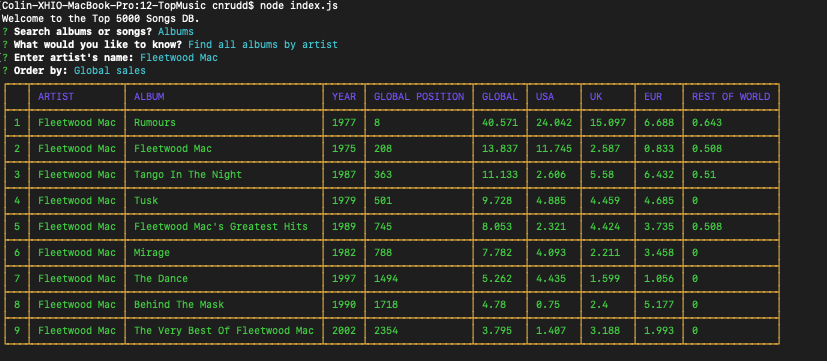
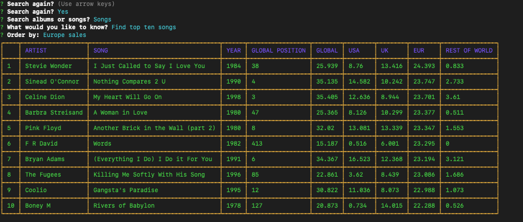

# **Sample Output**

# **How to Use/Run Instructions**
1.  Clone or fork & clone repo.
2.  run `npm i`
3.  Make database (see `sql/schema.sql`)
4.  Load data from `data` dir into the new database.  See `sql/import-data.sql` or use MySQLWorkbench GUI.
5.  This project uses `dotenv` to read DB config info from a `.env` file.  To run index.js on your machine, you need to add a `.env` file to your clone of this repo. It should contain the following keys with values appropriate to your setup:

      * DB_HOST=
      * DB_USER=
      * DB_PASS=
      * DB_NAME=

6.  Run app from command line with `node index` from within the project directory.
 

# **Development Instructions**

## Step 1:  Create DB, Import Data
* Create a database called `music_rankings_db` which will eventually house all of the music data contained within `TopSongs.csv`

* Within your database create a table called `songs` and create columns capable of holding all of the data contained within `TopSongs.csv` properly.
* The columns are: 
  * id (the primary key - does not auto increment, already in data)  `id`
  * artist name:     `artist`
  * song name:       `song`
  * year:            `year`
  * raw popularity score, entire world:  `raw_total`
  * raw popularity score, USA:  `raw_usa`
  * raw popularity score, UK: `raw_uk`
  * raw popularity score, Europe (i.e., non-English speaking countries in Europe): `raw_eur`
  * raw popularity score, rest of the world: `raw_row`

* All columns can be `NULL`, except `id`
  
* All of your code should be written and saved within a filed called `schema.sql` so that you can use this same code later should the need ever arise

* Look into how MySQL Workbench can import and export data files. What file types does it accept? How does it convert the data?
  
* Import the data from TopSongs.csv into your top5000 table.   Google how to do this.  it can be done via a SQL query, or via the MySQL Workbench GUI.

## Step 2:  Code a node app to query the DB.

* With all of your data successfully imported into the database, begin working on a Node console application which will allow a user to query for more specialized pieces of data. For example...

  * A query which returns all data for songs sung by a specific artist
  * A query which returns all artists who appear within the top 5000 more than once
  * A query which returns all data contained within the top 10 in the world
    * Bonus:  add more options here to find top 10 by region
  * A query which searches for a specific song in the top 5000 and returns the data for it

* HINT: There are some MySQL queries which could make some of these tasks even easier to accomplish. Feel free to look at MySQL's documentation to find some of them.

## Step 3: Time permitting, return search results that include album info

*  Modify your schema so that it also contains an `albums` table with the following columns:
  * id (the primary key - does not auto increment, already in data)  `id`
  * artist name:     `artist`
  * album name:       `album`
  * year:            `year`
  * raw popularity score, entire world:  `raw_total`
  * raw popularity score, USA:  `raw_usa`
  * raw popularity score, UK: `raw_uk`
  * raw popularity score, Europe (i.e., non-English speaking countries in Europe): `raw_eur`
  * raw popularity score, rest of the world: `raw_row`

* All columns can be `NULL`, except `id`

* Import the TopAlbums.csv file into the `albums` table.

* Modify your JS code so that it can return album information along with song information for the queryies above.  You can join the tables on matching `artist` values.
